# [V1.2]

## ⚡️ 优化
- 删除默认初始化管理员 添加自助注册功能
- 开放用户注册功能
- 优化手机端样式

# [V1.1]

## ⚡️ 优化
- 优化自适应布局
- 修改众多bug
- 优化用户全局体验

# [V1.0]

## Emby-Hub 管理系统详解 📊

> Emby-Hub 是一款专为 Emby 打造的一站式管理系统，集资源浏览、用户管理、风险控制、卡密分发等高级功能于一体，界面美观且功能强大，为 Emby 服务器管理员提供了高效便捷的运营工具。

### 登录界面 🔐

登录界面设计简洁大方，支持账号密码登录，为系统安全提供第一道保障。用户输入正确凭据后即可进入管理后台，开始各项操作。

### 导航菜单 🧭

导航菜单清晰分类了系统的所有核心功能模块，包括资源管理、用户中心、卡密系统、数据统计等，管理员可通过菜单快速跳转至目标功能页，提升操作效率。

### 渠道配置 🌐

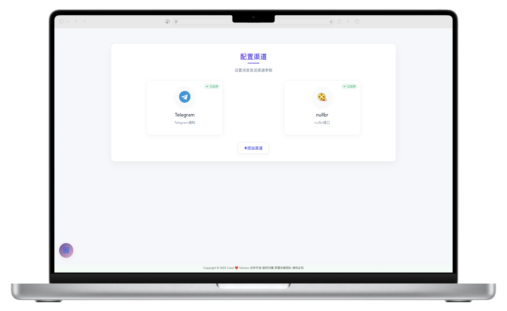

渠道配置功能允许管理员对不同的内容渠道进行管理和设置，可配置渠道名称、来源、优先级等参数，灵活整合各类资源，确保内容的丰富性和有序性。

### 探索影片 🔍

探索影片页面提供了精美的资源浏览体验，影片按类别、地区、热度等维度分类展示，搭配高清海报和简介，让管理员或用户能轻松发现感兴趣的内容。

### 管理相关 🔧

- **账户列表 📋**：
  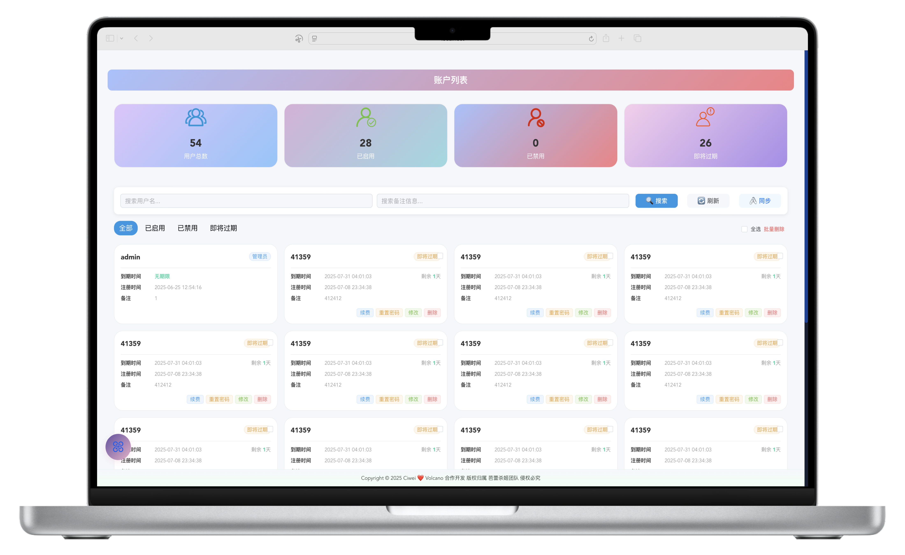
  集中展示所有用户账户信息，包括用户名、注册时间、会员状态、权限等级等，支持账户搜索、筛选和批量操作。

- **卡密管理 💳**：
  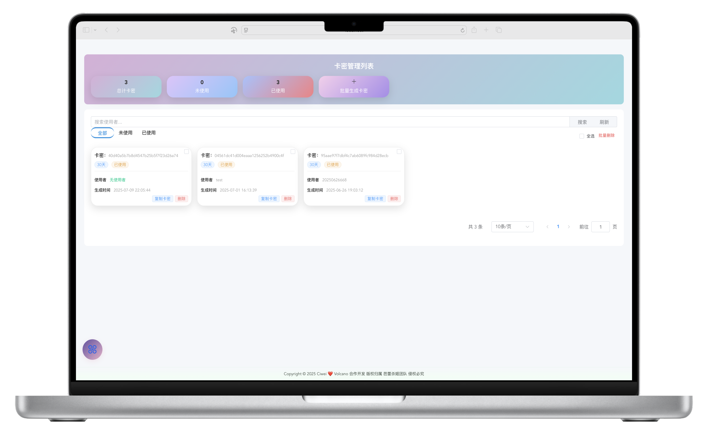
  可生成、发放、核销各类卡密（如会员时长卡、权限卡等），支持卡密批量创建和状态跟踪，方便进行会员营销。

- **添加用户 ➕**：
  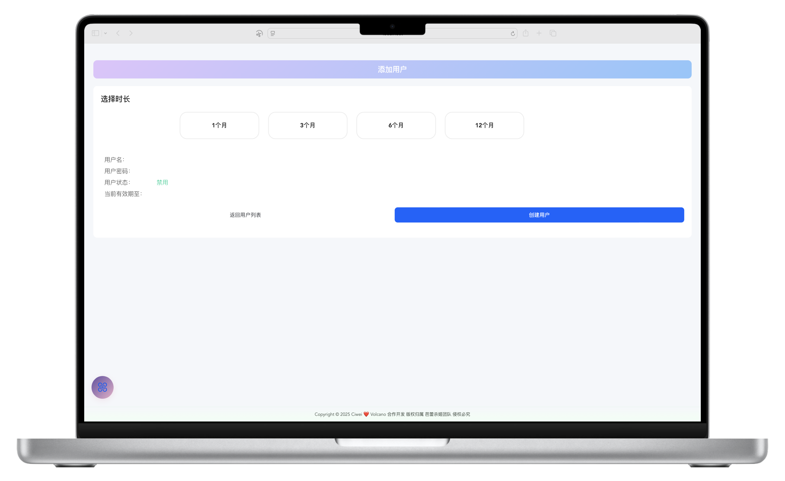
  提供便捷的用户创建入口，可设置用户昵称、密码、初始权限、会员期限等信息，快速完成新用户开户。

- **媒体中心 🎬**：
  
  管理所有媒体资源的核心模块，支持影片上传、元数据编辑、分类调整、封面替换等，确保媒体库规范有序。

- **找片页面 🔎**：
  
  强大的搜索工具，支持按片名、演员、导演、类型等多维度精准查找影片，大幅提升资源检索效率。

- **资源页面 📦**：
  
  展示资源的详细存储和分布情况，包括已占用空间、资源数量、更新时间等，帮助管理员掌握资源库状态。

- **求片列表 📝**：
  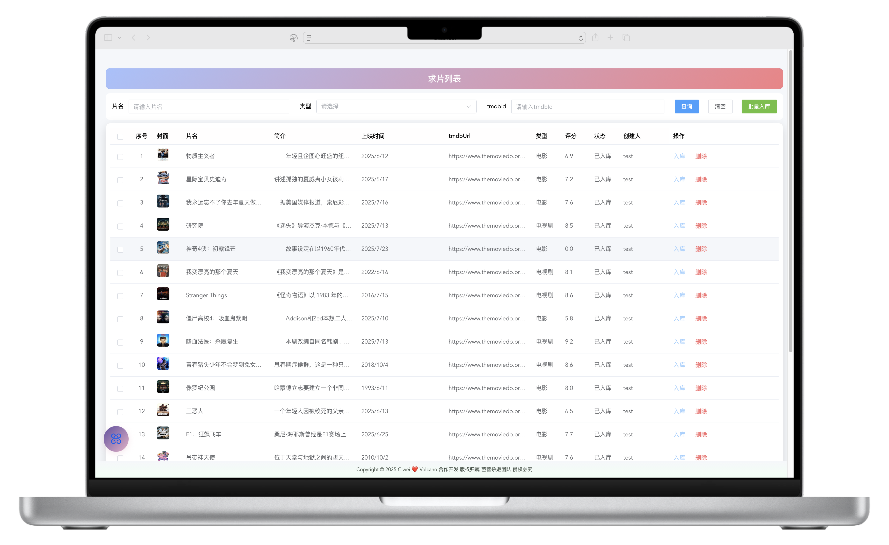
  汇总用户提交的求片需求，显示求片名称、提交用户、时间、状态等信息，便于管理员跟进处理。

### 推荐电影 🎥

推荐电影板块展示平台精选的优质电影资源，以图文并茂的方式呈现：

热门高分电影，吸引用户观看

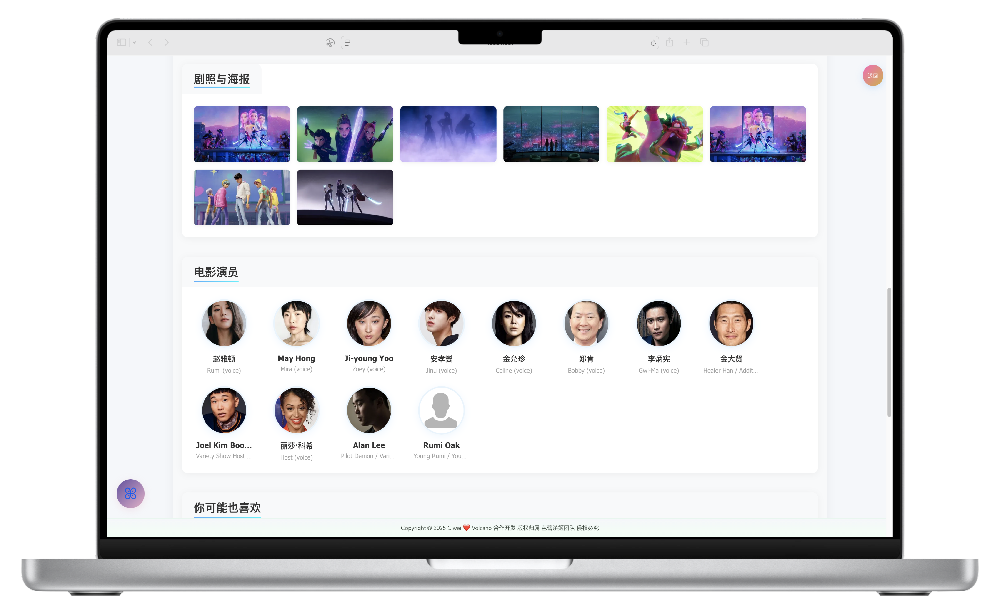
经典影片回顾，满足怀旧需求

新上线佳作，保持内容新鲜感

### 推荐剧集 📺

推荐剧集板块聚焦热门电视剧资源，分类展示不同题材的优质剧集：

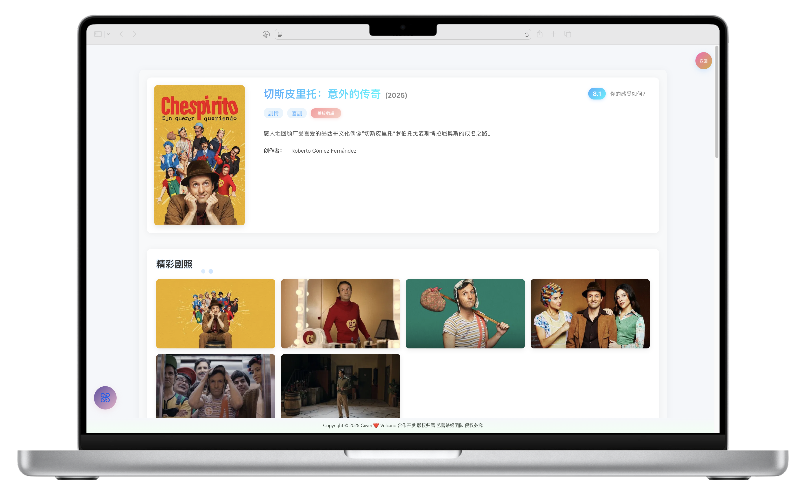
爆款热播剧，紧跟影视潮流

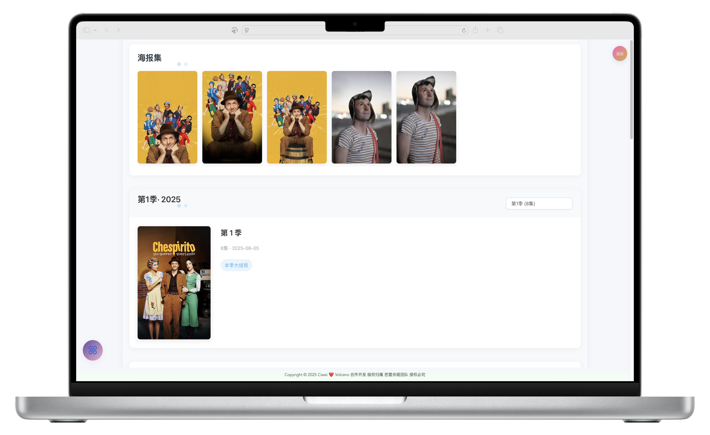
高分经典剧，口碑内容保障

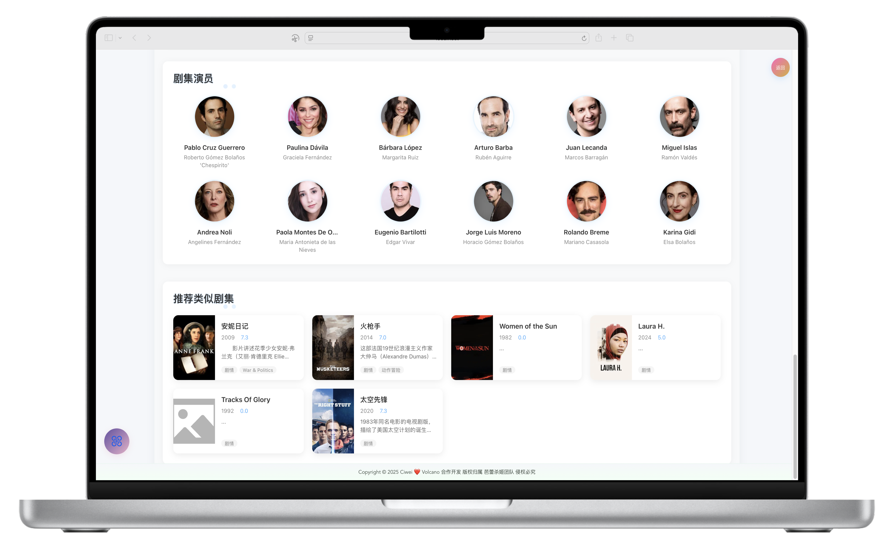
小众精品剧，丰富内容多样性

### 演员列表 🌟

演员列表汇集了平台资源中涉及的各类演员信息，按姓名、地区、代表作等分类，可快速查看演员参演的所有影片，方便进行内容关联管理。

### 演员详情 📝

演员详情页展示演员的详细资料，包括出生日期、国籍、演艺经历、代表作品等，同时关联其参演的所有影片资源，为内容整理提供便利。

### 播放统计 📈

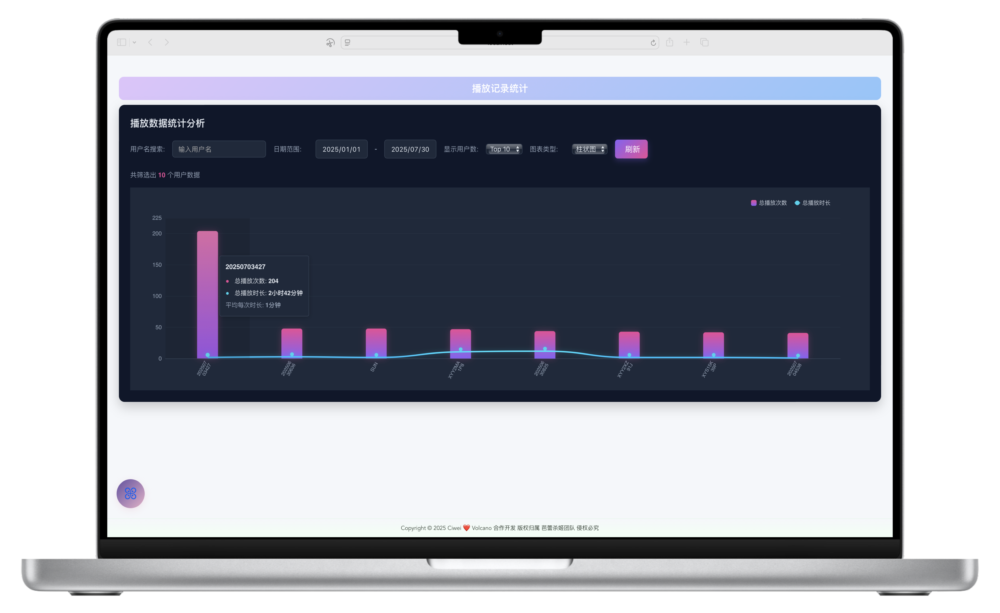

播放统计功能通过图表直观展示平台的播放数据，包括每日播放量、热门影片排行、用户观看时长分布等，帮助管理员掌握平台运营热度和用户偏好。

### 播放记录 🕒

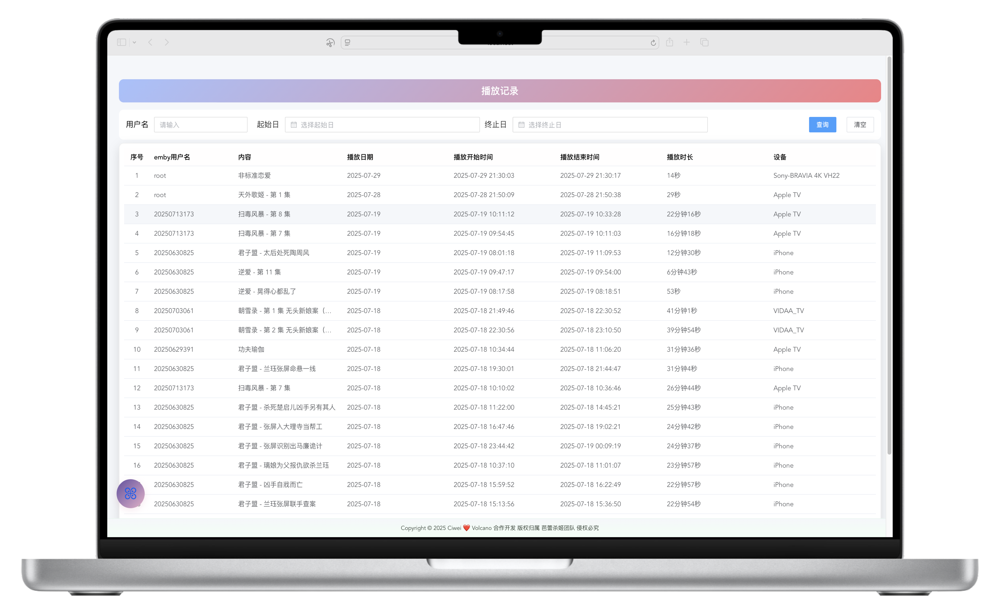

记录所有用户的观看历史，包括观看影片、开始时间、结束时间、观看进度等信息，便于追踪用户行为和解决播放相关问题。

### 用户详情 👤

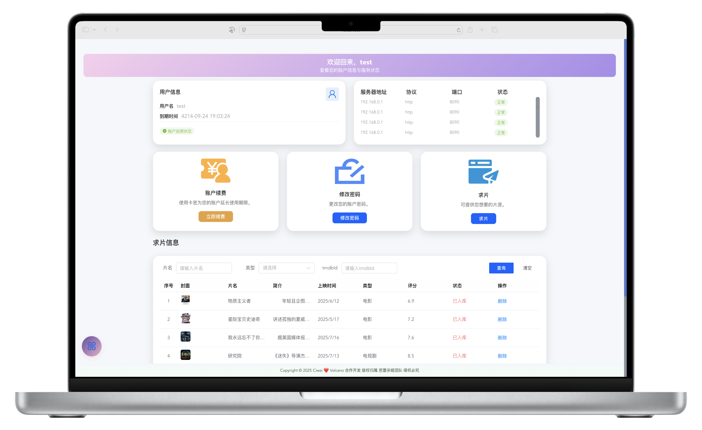

用户详情页展示单个用户的全面信息，包括基本资料、会员详情、观看记录、消费记录、权限设置等，支持对用户进行个性化管理和服务调整。

### 求片内容 📮

展示用户求片的详细内容，包括求片名称、具体描述、期望类型、联系方式等，管理员可在此页面标记处理状态（已接收、已解决、已拒绝），并与用户互动。

### 账户续费 🔄

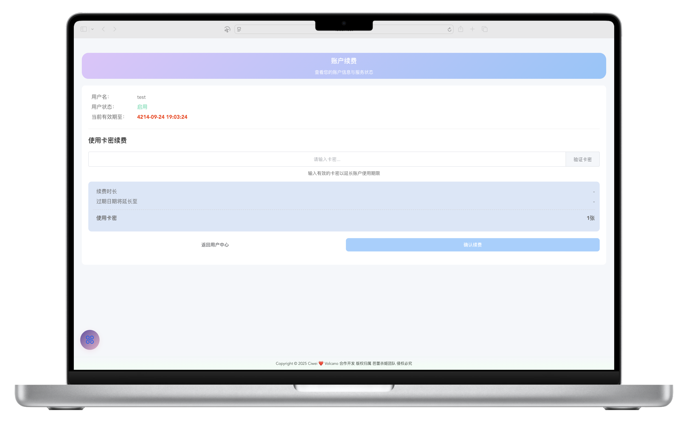

账户续费功能支持为用户延长会员期限，可选择续费时长、支付方式（如卡密兑换、手动续费），并生成续费记录，确保会员服务的连续性。

---

如果觉得内容对你有帮助，欢迎通过以下方式支持作者 ✨，你的鼓励是持续创作的动力呀～

### 联系方式 📞
- TG群聊：🌐 [TG群聊](https://t.me/EmbyHubQP) 可咨询合作、反馈建议或表达支持

---